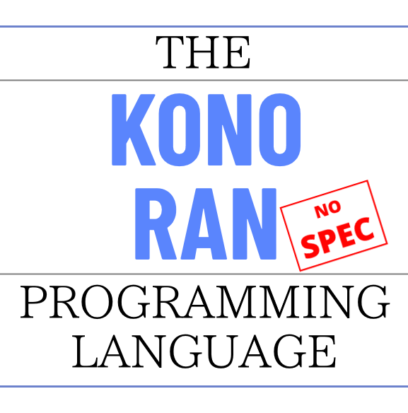

# Konoran

  

Konoran is a very simple low-level programming language (simpler than C) designed to be used as a compiler target. It is meant to be human readable and writeable, and provide high-level features like structs and arrays. At the same time, it aims to be simple enough that a new, from-scratch reimplementation of Konoran can (in theory) be built by a single skilled developer given a few weeks. The core of the compiler is under 3000 LoC (lines of code) long.

Konoran can be **100% fully learned**, including strange edge cases, by an experienced C, C++, Rust, or Go programmer in a single day.

Konoran is not a pipe dream; it already exists and has a working, fast, complete implementation.

Example of some konoran code:

```rust
f32 func_gravity()
{
    u64 i = 0u64;
    f64 yvel = 0.0f64;
    f64 y = 0.0f64;
    f64 gravity = 9.8f64;
    f64 delta = 0.001f64;
    
head:
    yvel = yvel + delta*gravity*0.5f64;
    y = y + yvel*delta;
    yvel = yvel + delta*gravity*0.5f64;
    
    i = i + 1u64;
    
    if (i < 500000000u64)
        goto head;
    
    return (y) as f32;
}
```

## Design overview

Differences from assembly:

1) Variables, not stack slots or push/pull operations or registers
2) C-like expression handling, not a list of opcodes
3) Real type system, including structs, arrays, etc
4) Calling convention is abstracted away
5) Explicit functions, not a pile of machine code with labels

Differences from C:

1) No structured control flow, only `goto ...;` and `if (...) goto ...;`
2) No preprocessor, includes, macros, etc
3) Strict static typing only, no weak typing, must manually cast between types even if a lossless conversion exists
4) Functions can call each other in any order with no pre-declaration; a function signature collection pass is run before compilation
5) Struct types are in the same situation as functions, pre-declarations are not needed
6) No pre-declarations at all anywhere; the only non-defining declarations are imports from other modules
7) No expression type analysis pass; functions can be compiled with recursive descent (on the AST) without looking ahead
8) No "platform-defined" type sizes; f32, f64, i8, i16, etc. encode their exact bit count precisely, and there's no generic "int" type.

Some things that are probably subject to change:

1) No block scopes (yet - probably subject to change!)
2) Variable declarations (NOT their definitions) are hoisted to the top of the function (at the moment - probably subject to change!)
3) No variadic functions (might be needed for better C ABI compatibility)

Konoran is not meant to be the ultimate, or even a particularly powerful, compiler target language. It is meant to be used by high-level language projects that don't have the manpower or smarts to learn LLVM or machine code generation or anything else. As such, it doesn't expose everything that every target CPU is capable of, like SIMD intrinsics, branch probability metadata, static data location directives, dynamic stack allocations, etc. It only exposes what you need to generate *relatively* efficient machine code from other, much higher-level code.

However, things that are *necessary* for proper low-level programming, like volatile memory access, and pointer conjuration (i.e. hardcoded pointer values), are exposed. Also, intrinsics *are* exposed, but limited in number, and they're implementation-defined (except memcpy etc, which must be provided).

Konoran's reference implementation is currently built on top of LLVM as a JIT compiler, and executes a single file. However, multiple konoran modules can be linked together without issue, just like C object files. Also, I plan on implementing a pure "reference interpreter" for konoran that doesn't need to pull in LLVM to be built, and also as a demonstration of how simple the language is.

Konoran also aims to minimize the about of UB that it exposes, but this is fraught and not guaranteed, as low-level programming necessarily involves things that CPUs themselves can consider to trigger UB, like raw memory access. However, a best effort will be done to remove UB from things that shouldn't have UB in them, like integer arithmetic, as noticed.

Konoran's reference implementation uses a declarative grammar (i.e. specified in a text file, not hardcoded) with a custom PEG-like dynamic parser generator. So, the grammar is fully defined and has no ambiguities. The entire parser is less than 1000 lines long, including comments, empty lines, and lines with only punctuation.

## TODO

- Write documentation
- Write a spec
- Implement string literals
- - they will compile down to u8 arrays
- - `r""` for non-null-terminated, no escape sequences
- - `c""` for null terminated with escape sequences
- Maybe implement blocks, block scope, and remove hoisting

# License

(Some files may be licensed under the CC0 license, which is more permissive than the following Apache 2.0 license. When they are, they are noted as such.)

Copyright "Wareya" (wareya@gmail.com) and any contributors

Licensed under the Apache License v2.0, with LLVM Exceptions and an
additional custom exception that makes the license more permissive.
The custom exception may be removed, allowing you to use this software
under the SPDX-identified `Apache-2.0 WITH LLVM-exception` license. See
LICENSE.txt and the below License Exceptions section for details.

Unless required by applicable law or agreed to in writing, software
distributed under the License is distributed on an "AS IS" BASIS,
WITHOUT WARRANTIES OR CONDITIONS OF ANY KIND, either express or implied.
See the License for the specific language governing permissions and
limitations under the License.

## License Exceptions

This section is not legal code, it's a human-readable summary.

This software is licensed with the LLVM exceptions on top of the
Apache 2.0 license. These exceptions make it compatible with the GNU
GPLv2 and also waive certain restrictions when distributing binaries.

This software is licensed an additional, custom exception that makes the
Apache 2.0 license more permissive by not requiring modified source
files to be marked with prominent notices. This exception can be
removed, turning the license into pure `Apache-2.0 WITH LLVM-exception`.
In other words, as a user or downstream project or dependent, you can
ignore this exception's existence, and as a contributor or maintainer,
it means that you have one less responsibility.

These exceptions do not necessarily apply to any dependencies or
dependents of this software, unless they independently have the same or
similar exceptions.
